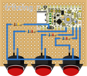

# Let's Make $5 DIY Keyboard Together! / 一緒につくろう、700円 自作キーボード！

自作キーボードは価格にハードルを感じます。マイコンボードの安さを活かして、700円で3キーのキーボードを自作します。<span style="color:red">**怪我をしないよう安全に十分注意して**</span>ください。なお、本記事内の価格は全て税抜き・送料抜きです。

[](.src/img/PXL_20251205_092349312.jpg) [](.src/img/PXL_20251205_092609043.jpg) [](.src/img/PXL_20251205_092124217.jpg)

# Status / ステータス

- バージョン20251205です。
- キーボード材料費: 700円未満、工具費: 1,400円(イニシャル)です。
- 汎用品・市販品(日本国内販売品)のみで製作します。
- 製作所要時間は90~120minです。

# Tools / 工具

**合計1,400円**です。なくても製作できますが、ピンセットはあったほうが作業性がよいです。

| Name     | Price (JPY) | Qty. | Subtotal |
| --- | --- | --- | --- |
| [ハンダごて　３０Ｗ - 100均 通販 ダイソーネットストア【公式】](https://jp.daisonet.com/products/4549131388800) | 500 | 1 | 500 |
| [ハンダ　（ヤニ入） - 100均 通販 ダイソーネットストア【公式】](https://jp.daisonet.com/products/4550480244884) | 100 | 1 | 100 |
| [銅製針金 - 100均 通販 ダイソーネットストア【公式】](https://jp.daisonet.com/products/4550480468686) | 100 | 1 | 100 |
| [ミニニッパー - 100均 通販 ダイソーネットストア【公式】](https://jp.daisonet.com/products/4549131301656) | 100 | 1 | 100 |
| WANT [長細型ピンセット - 100均 通販 ダイソーネットストア【公式】](https://jp.daisonet.com/products/4550480538495) | 100 | 1 | 100 |
| [６本差替ドライバー - 100均 通販 ダイソーネットストア【公式】](https://jp.daisonet.com/products/4550480254944) | 100 | 1 | 100 |
| [チタンコーティング鉄工ドリル刃６角ビット付 - 100均 通販 ダイソーネットストア【公式】](https://jp.daisonet.com/products/4984343920316) | 100 | 1 | 100 |
| [チタンコーティング鉄工ドリル刃６角ビット付 - 100均 通販 ダイソーネットストア【公式】](https://jp.daisonet.com/products/4984343920378) | 100 | 1 | 100 |
| [チタンコーティング鉄工ドリル刃６角ビット付 - 100均 通販 ダイソーネットストア【公式】](https://jp.daisonet.com/products/4984343920392) | 100 | 1 | 100 |
| WANT [USBケーブル USB2.0 Type-Cオス⇔Type-Cオス 0.5m: ケーブル・コネクター 秋月電子通商-電子部品・ネット通販](https://akizukidenshi.com/catalog/g/g117018/) *スマホで動作確認用。 | 100 | 1 | 100 |

# Parts / 部品

**合計688.7円**です。更にコストダウンしたい場合、特にキーキャップ・キースイッチはアリエクで探すととても安くなります。なお、細かい部品はパック買い前提です。バラ買いでは高くなります。

| Name     | Price (JPY) | Qty. | Subtotal |
| --- | --- | --- | --- |
| [両面スルーホールユニバーサル基板 5*7: 基板・ブレッドボード・ラグ板 秋月電子通商-電子部品・ネット通販](https://akizukidenshi.com/catalog/g/g112977/) | 55 | 1 | 55 |
| [カーボン抵抗(炭素皮膜抵抗) 1/6W6.8kΩ: 受動部品 秋月電子通商-電子部品・ネット通販](https://akizukidenshi.com/catalog/g/g116682/) (100 pcs) | 0.46 | 3 | 1.38 |
| [カーボン抵抗(炭素皮膜抵抗) 1/4W180kΩ: 受動部品 秋月電子通商-電子部品・ネット通販](https://akizukidenshi.com/catalog/g/g125184/) (100 pcs) | 0.46 | 1 | 0.46 |
| [Kailh Super Speed Switch / Copper / Tactile](https://shop.yushakobo.jp/products/4276?variant=43583544066279) (35 pcs)  | 40 | 3 | 120 |
| [Amazon.co.jp: オーディオファン ABSキーキャップ メカニカルキーボード 12個入り キーキャップ マット バックライトキーキャップ キーキャップR4 キーキャップ十字軸 透明 : パソコン・周辺機器](https://www.amazon.co.jp/dp/B0DTKBGN8F) (12 pcs) | 27.27 | 3 | 81.81 |
| [UIAPduino Pro Micro CH32V003 V1.4 — スイッチサイエンス](https://www.switch-science.com/products/9914) | 263.64 | 1 | 263.64 |
| [細ピンヘッダ 1×40 (青): ケーブル・コネクター 秋月電子通商-電子部品・ネット通販](https://akizukidenshi.com/catalog/g/g106637) | 55 | 1 | 55 |
| [分割ロングピンソケット 1×42 (42P): ケーブル・コネクター 秋月電子通商-電子部品・ネット通販](https://akizukidenshi.com/catalog/g/g105779) | 73 | 1 | 73 |
| [接着シール付き透明ゴムクッション: ケース・ネジ・固定具 秋月電子通商-電子部品・ネット通販](https://akizukidenshi.com/catalog/g/g110093/) (50 pcs) | 8.92 | 4 | 35.68 |
| WANT [チャック袋75mmx100mmx100ミクロン(Cタイプ)(厚手): 包装・梱包 秋月電子通商-電子部品・ネット通販](https://akizukidenshi.com/catalog/g/g104087/) (100 pcs) *キット配布用 | 2.73 | 1 | 2.73 |

# Circuit / 回路

[](.src/img/low-cost_diy_keyboard_20251205.svg)

[Fritzingプロジェクトファイルをダウンロード](.src/doc/low-cost_diy_keyboard_20251205.fzz)

# Crafting / 製作

キースイッチの配置を決め、突起逃がし穴を開けます。<span style="color:red">**電動工具を使う場合は、絶対に手袋をしない**</span>でください。

[](.src/img/PXL_20251205_055703657.jpg) [](.src/img/PXL_20251205_060207544.jpg) [](.src/img/PXL_20251205_060005860.jpg)

ピンの合う位置・角度を探してキースイッチを仮挿入し、キーキャップを付けて干渉しないことを確認します。

[](.src/img/PXL_20251205_060752710.jpg) [](.src/img/PXL_20251205_061050582.jpg) [](.src/img/PXL_20251205_060952252.jpg)

マイコンボードと抵抗(180k x1、6.8k x3)も仮挿入し、底面の引き回しとゴム足の位置を確認し はんだ します。

[](.src/img/PXL_20251205_064940570.jpg) [](.src/img/PXL_20251205_065044097.jpg) [](.src/img/PXL_20251205_092124217.jpg)

# Program / プログラム

- リポジトリ: https://github.com/YuukiUmeta-UIAP/rv003usb/tree/custom/main/demo_pikokey_hid
- 前提環境：あらかじめ「[最新のオリジナルch32fun開発環境ではじめる](https://www.uiap.jp/uiapduino/pro-micro/ch32v003/v1dot4#with-ch32fun-development-environment)」または「[オリジナルch32fun開発環境とPlatformIOではじめる](https://www.uiap.jp/uiapduino/pro-micro/ch32v003/v1dot4#with-ch32fun-development-environment)」でLチカまでしておきます。WindowsではVS Code+PlatformIOを推奨します。

## バイナリファイルを書き込む

- 「O、K、[Enter]」設定のバイナリ: [bin/pikokey_customed_for_low-cost_diy_keyboard_20251205.bin](bin/pikokey_customed_for_low-cost_diy_keyboard_20251205.bin)

> [!NOTE]
> 同時に2マイコンボードを書き込み待機させるとうまく書き込みできません。1ボードだけ書き込み待機させ、書き込みが終わったマイコンボードはUSBから外して下さい。

```bash
minichlink -c 0x1209b803 -w pikokey_customed_for_low-cost_diy_keyboard_20251205.bin flash // バイナリの書き込み
```

## ソースコードからビルドしてキーマップを変更する

コマンドでキーボードのファームウェアバイナリファイルをビルドします。PlatformIOではGUI操作です。

```bash
git clone --recurse-submodules https://github.com/YuukiUmeta-UIAP/rv003usb.git
cd rv003usb/demo_pikokey_hid
```

`help_functions.h`を修正して3キー化します。[ピン配置図](https://www.uiap.jp/uiapduino/pro-micro/ch32v003/v1dot4#documents)を見て配線に対応するIOポートを設定します。

```cpp
// Define Number of Rows and Columns
#define NUM_COLS 3
#define NUM_ROWS 1

// Define Columns (Outputs)
const int columns_ports[NUM_COLS] = {
	GPIO_port_C, // Column 0 - PC3
	GPIO_port_C, // Column 1 - PC5
	GPIO_port_C, // Column 2 - PC6
};

const uint8_t columns_pins[NUM_COLS] = {
	3, // PC3
	5, // PC5
	6, // PC6
};

// Define Rows (Inputs)
const int rows_ports[NUM_ROWS] = {
	GPIO_port_C, // Row 0 - PC7
};

const uint8_t rows_pins[NUM_ROWS] = {
	7, // PC7
};
```

この例ではキーマップを「O、K、(Enter)」と設定します。なお、レイヤ2は「N、G、(Enter)」ですが、レイヤ2へ切り替えるスイッチ(HID_KEY_FN)がありません。マイコンボードのリセットスイッチはPD7の入力スイッチにすることもできるので、余力があればPD7でレイヤ切り替えにチャレンジしてみてください。説明は割愛します。

```cpp
#if BOARD_LORR == 1
	const uint8_t keymap[NUM_ROWS][NUM_COLS] = { // For 3-key board keymap 1
		{ HID_KEY_O, HID_KEY_K, HID_KEY_ENTER }
	};
	const uint8_t keymap2[NUM_ROWS][NUM_COLS] = { // For 3-key board keymap 2 when HID_KEY_FN pushed
		{ HID_KEY_N, HID_KEY_G, HID_KEY_ENTER }
	};
#elif BOARD_LORR == 2
```

上書き保存してからビルドします。プログラムを変更したらビルドする前に毎回`make clean`もしてください。

```bash
make clean
make build
```

マイコンボードに書き込みます。

```bash
minichlink -c 0x1209b803 -w pikokey.bin flash
```

# Check Working / 動作確認

パソコンやスマホなどのUSBホストへ接続し、キーボード(USB HID)として入力できれば完成です！

# 雑記・メモ

製作工程検討用の1回目の試作です。ノープランかつ有り合わせ材料のトライでも約90minで製作できました。

[](.src/img/PXL_20251125_064606520.jpg) [](.src/img/PXL_20251125_064638519.jpg) [](.src/img/PXL_20251125_064817963.jpg)
