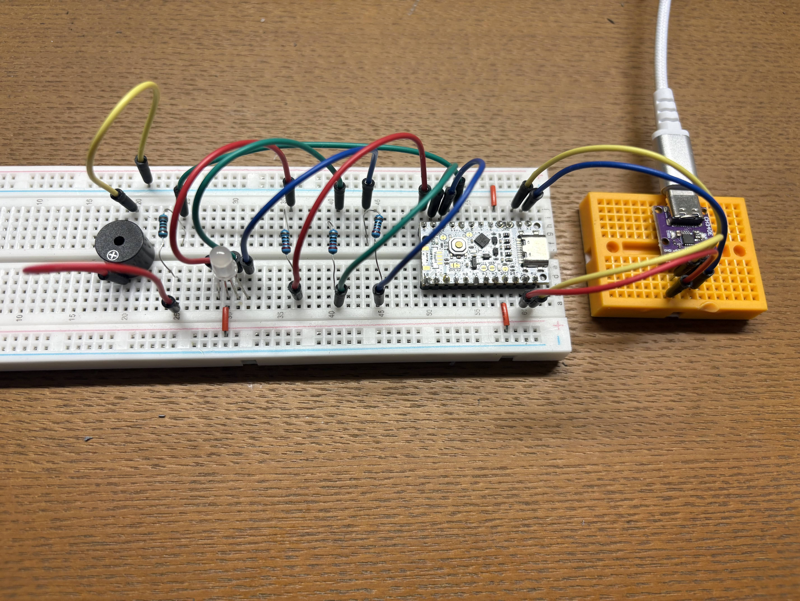
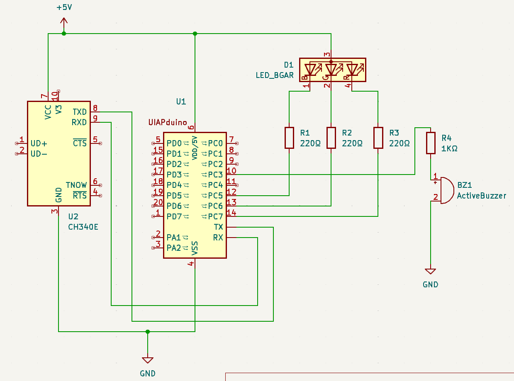

# Misskey_Nostr_Notifier

分散型SNSである「Misskey」「Nostr」の通知を受け取り、それを音と光で通知するデバイス

MisskeyとNostrの通知はNode.jsがWebSocketを通じて取得し、それをシリアル通信でUIAPduinoに送信、それを解釈してフルカラーLEDやパッシブブザーを動かしている。

Misskeyの通知が来た時は緑色に、Nostrの通知が来た時は紫色に光る。



<video src="./.src/misskey_nostr.mp4"></video>

# Status / ステータス
- ver1.0です
- Node.jsが実行できる環境なら動作する

# 材料
- UIAPduino
- CH340E
- フルカラーLED
- 抵抗220Ω x 3
- 抵抗1kΩ
- アクティブブザー

# Circuit / 回路



UIAPduino単独では、上手くUSBケーブルでのシリアル通信を行うことができなかったため、PCとUIAPduinoの間に変換モジュールCH340Eを挟んでいる\
[rv003usb](https://github.com/cnlohr/rv003usb)を上手く活用すれば、UIAPduinoとPCを直接つなぐことができるのかもしれない。

# Program / プログラム
ソースコードに関しては以下のリポジトリにて管理されている。
https://github.com/moyashi170607/Misskey_Nostr_Notifier

環境構築にはPlatformIOを用いている。詳しい構成や書き込み手順についても上記のリポジトリを参照してほしい。

# 使い方
1. UIAPduinoに`misskey_nostr_notifier_uiap`内のプログラムを書きこむ
2. `misskey_nostr_notifier_node`に`config.yml`を作成
3. `config.yml`に必要な設定を書き込む
```
PK_HEX: あなたのNostr公開鍵（HEX形式）
RELAY:
  - リレーサーバーのWebSocketのURL1
  - URL2
  - URL3

MISSKEY_ORIGIN: 接続するMisskeyインスタンスのオリジン(URL)
MISSKEY_API: あなたのMisskeyアカウントAPIキー

PORT: マイコンを接続するポート
```
4. `npm run start`

# 改善点
- PCと接続する必要があるため、可能ならばマイコン側で完結するようにしたい。
  Wi-Fiモジュールなどをつなぐことで可能になるだろうか。
- 他のSNSにも対応したい。Blueskyとか
- Node.jsじゃなくてRustとかでPC側のコードを実装して、Node.jsに依存しないようにしたい
